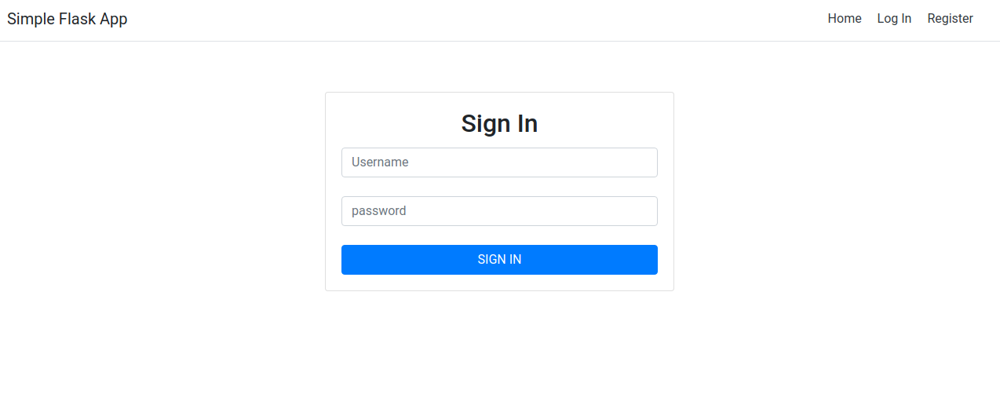

## Flask Register Example
A simple flask project with register and login features.

### Require
- Python
- virtualenv

### Install
- Create your virtual environment, step by step to create virtual environment you can check this [link](https://dev.to/codemouse92/dead-simple-python-virtual-environments-and-pip-5b56)
- Activate your virtual environment
- Install dependencies in your virtual environment, `pip install -r requirements.txt`
- Export your flask environment with `export FLASK_APP=app.py`
- Then, run command `flask run`
- Open up your browser and enter the following url address field:  `localhost:5000`

### Screenshoots
#### Login page

#### Register page

#### Register validation

### References
- [https://blog.miguelgrinberg.com/post/the-flask-mega-tutorial-part-i-hello-world](https://blog.miguelgrinberg.com/post/the-flask-mega-tutorial-part-i-hello-world)
- [https://dev.to/codemouse92/dead-simple-python-virtual-environments-and-pip-5b56](https://dev.to/codemouse92/dead-simple-python-virtual-environments-and-pip-5b56)
